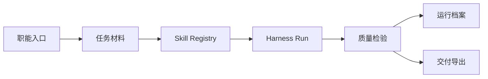

# OperAI Harness

> 面向企业运营团队的智能运营编排系统。  
> 把运营需求从「临时问 AI」变成「按职能进入、按 Skill 编排、按质量检验交付」的可复用工作流。


OperAI Harness 不是一个普通聊天窗口，也不是单纯的文案生成器。它围绕真实运营团队的岗位分工，将任务理解、能力选择、上下文传递、运行档案、质量检验和交付导出串成一条 Harness 链路，让团队的运营方法可以沉淀、复核和持续迭代。

## 为什么做

企业运营每天处理的是一组混合型工作：活动策划、内容生产、渠道排期、用户分层、增长投放、产品反馈、社群互动和市场策略。传统 AI 对话很容易把所有问题都回答成「一段文案」，但真实运营需要的是清晰的方案、可执行的动作、证据和风险边界。

OperAI 的设计目标是让运营人员先选择自己的职能场景，再由系统自动编排合适的 Skill 和智能体，而不是要求用户理解底层模型、Prompt 或工程链路。

## 产品能力

| 模块 | 说明 |
| --- | --- |
| 8 个职能入口 | 内容运营、用户运营、活动运营、渠道运营、增长投放、产品运营、社群运营、市场策略 |
| 10 个运营智能体 | 覆盖数据洞察、内容、用户、活动、渠道、增长、市场、产品、社群、交易等判断 |
| 52 个可组合 Skill | 将公司级运营知识拆成可推荐、可组合、可扩展的能力单元 |
| Harness 编排引擎 | 根据职能和任务材料自动选择 Skill，安排执行顺序并传递上下文 |
| 质量检验 | 检查证据覆盖、风险边界、平台适配、交付完整度和表达口径 |
| Skill Studio | 预留自定义 Skill 入口，方便团队沉淀自己的运营方法 |
| API 配置面板 | 支持 DeepSeek、OpenAI 及其他 OpenAI-compatible 模型服务 |

## 工作流



## 页面入口

本项目包含两个本地服务：

- 产品首页：`http://127.0.0.1:8080`
- Harness 工作台：`http://127.0.0.1:8501`

首页由 `frontend/` 提供，工作台由 Streamlit 提供。

## 快速开始

### 1. 安装依赖

```powershell
cd operai-mvp
pip install -r requirements.txt
```

如需使用锁定版本：

```powershell
pip install -r requirements.lock
```

### 2. 配置环境变量

复制示例配置：

```powershell
Copy-Item .env.example .env
```

`.env` 示例：

```env
OPENAI_API_KEY=
OPENAI_BASE_URL=https://api.deepseek.com
OPENAI_MODEL=deepseek-v4-pro
OPERAI_MOCK=1
```

说明：

- 不填写 `OPENAI_API_KEY` 时，系统会使用 Mock / 规则路径，适合离线演示和本地测试。
- 填写 `OPENAI_API_KEY` 后，会调用 OpenAI-compatible 接口。
- `OPERAI_MOCK=1` 可强制使用本地 Mock。
- 请不要把真实 `.env` 提交到公开仓库。

### 3. 启动服务

推荐一键启动：

```powershell
.\start.ps1
```

也可以手动启动：

```powershell
# Streamlit 工作台
python -m streamlit run app.py

# 产品首页
python serve.py
```

## 测试

```powershell
$env:OPERAI_MOCK="1"
python -m pytest -q
```

当前测试覆盖：

- Agent 输出契约
- Harness DAG 执行
- Skill Registry
- 职能交付物模型
- 中文标签显示
- 输出渲染布局兜底
- 敏感词与质量检验
- Markdown / Word 导出

## 目录结构

```text
operai-mvp/
├─ app.py                         # Streamlit Harness 工作台
├─ serve.py                       # 产品首页本地服务
├─ start.ps1                      # Windows 一键启动脚本
├─ config.yaml                    # 运行时配置
├─ frontend/                      # 产品首页与视觉系统
├─ src/
│  ├─ agents/                     # 10 个运营智能体
│  ├─ harness/                    # Skill Registry、DAG Runner、质量检验
│  ├─ storage/                    # 本地存储
│  ├─ role_deliverables.py        # 8 个职能入口与交付物模型
│  ├─ render_output.py            # 输出结果渲染
│  ├─ display_labels.py           # 内部字段中文化
│  └─ voice_styles.py             # 50 个表达风格预设
├─ tests/                         # 自动化测试
├─ docs/                          # 设计与实现文档
└─ packs/                         # 兼容层配置
```

## 关键模块

### Harness + Skill

- `src/harness/skill_registry.py`：内置运营 Skill，支持推荐与自定义 Skill 保存。
- `src/role_deliverables.py`：定义 8 个职能入口及其默认交付物。
- `src/harness/dag_runner.py`：顺序执行智能体插件，并注入上游上下文。
- `src/harness/verify_gate.py`：质量检验与风险复核。

### Agent 集群

`src/agents/` 中包含 10 个运营智能体：

| 代号 | 职责 |
| --- | --- |
| D | 数据与材料洞察 |
| C | 内容运营 |
| U | 用户运营 |
| A | 活动运营 |
| N | 渠道运营 |
| F | 流量 / 增长 |
| M | 市场策略 |
| P | 产品运营 |
| S | 社群运营 |
| E | 交易运营 |

### 前端体验

- `frontend/index.html`：产品首页。
- `frontend/styles.css`：首页视觉系统。
- `frontend/streamlit-theme.css`：Streamlit 工作台深度美化样式。
- `frontend/main.js`：滚动、鼠标与页面动效。

## API 与模型配置

OperAI 使用 OpenAI-compatible 协议，可以接入 DeepSeek、OpenAI 或其他兼容服务。

基础配置：

```env
OPENAI_API_KEY=your-api-key
OPENAI_BASE_URL=https://api.deepseek.com
OPENAI_MODEL=deepseek-v4-pro
```

工作台的「运行设置」页也提供 API 信息配置入口，便于临时切换模型服务。

## 开源安全

本仓库不会提交：

- `.env`
- 本地数据库 `data/operai.sqlite3`
- 运行日志 `data/logs/`
- Python 缓存 `__pycache__/`
- Pytest 缓存 `.pytest_cache/`
- Streamlit 本地密钥 `.streamlit/secrets.toml`

如果你 fork 或二次开发，请确认不要把真实 API Key、用户数据和运行日志上传到公开仓库。

## License

MIT License
