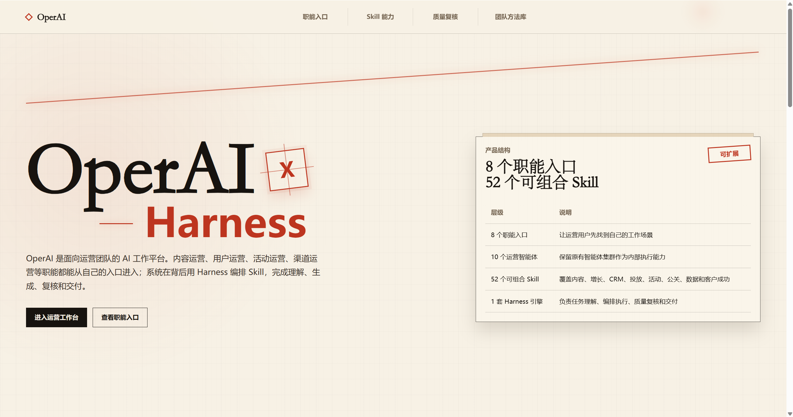
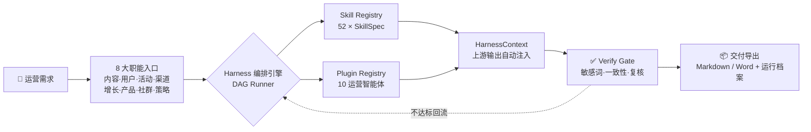

<div align="center">



# 🤖 OperAI · 智能运营编排系统

### 让运营，从"随机问 AI"变成"可复用的工业化流程"

_不是又一个聊天窗口，而是一条把任务理解 → 能力调度 → 质量检验 → 交付沉淀串起来的 Harness 流水线。_

<br/>


[核心理念](#-核心理念) · [架构](#-系统架构) · [能力矩阵](#-能力矩阵) · [快速开始](#-快速开始) · [目录结构](#-目录结构)

</div>

---

## 💡 核心理念

企业运营的痛点从来不是"AI 不会写"，而是——

> **任务五花八门、标准无法统一、经验留不下来。** 今天问 AI 写条小红书，明天又从零开始，方法论散落在每个人的聊天记录里。

**OperAI** 把真实运营岗位的分工固化成系统：**8 大职能入口**引导需求 → **Harness 编排引擎**自动匹配 **52 个 Skill** 与 **10 个专业智能体** → 经过**质量检验网关** → 交付含证据摘录、风险提醒与执行动作的标准化方案。运营方法论，第一次可以在团队里**沉淀、复用、迭代**。

---

## 🏗️ 系统架构


```mermaid
flowchart LR
    A[👤 运营需求] --> B[8 大职能入口<br/>内容·用户·活动·渠道<br/>增长·产品·社群·策略]
    B --> C{Harness 编排引擎<br/>DAG Runner}
    C --> D[Skill Registry<br/>52 × SkillSpec]
    C --> E[Plugin Registry<br/>10 运营智能体]
    D & E --> F[HarnessContext<br/>上游输出自动注入]
    F --> G[✅ Verify Gate<br/>敏感词·一致性·复核]
    G --> H[📦 交付导出<br/>Markdown / Word + 运行档案]
    G -. 不达标回流 .-> C
```

- **编排引擎** `src/harness/dag_runner.py`：按 DAG 顺序调用 Agent，自动把前序输出注入当前 `HarnessContext`。
- **注册机制**：Agent 经 `plugin_registry.py` 解耦注册；Skill 在 `skill_registry.py` 以 `SkillSpec` 集中管理。
- **数据基座**：SQLite 记录任务状态与运行档案，`role_deliverables.py` 定义各职能的交付模型与质量锚点。

---

## 🧩 能力矩阵

| 模块 | 内容 |
| :--- | :--- |
| 🚪 **8 大职能入口** | 内容运营 · 用户运营 · 活动运营 · 渠道运营 · 增长投放 · 产品运营 · 社群运营 · 市场策略 |
| 🤝 **10 个运营智能体** | 按维度分工（数据 D / 内容 C / 用户 U …），各司逻辑判断与生产 |
| 🛠️ **52 个标准化 Skill** | 从"人群分层"到"SEO 关键词地图"，每个都有明确输入输出契约 |
| 🔀 **Harness 编排引擎** | 基于 DAG 的多智能体协作，自动上下文注入与任务链编排 |
| 🛡️ **质量检验网关** | 敏感词扫描 + 跨平台一致性 + 人工复核，输出可直接上会 |
| 🎛️ **Skill Studio** | 团队自定义扩展 Skill，把私域运营经验变成系统能力 |
| 📤 **多格式交付** | 生成运行档案，一键导出 Markdown / Word 交付物包 |

---

## 🚀 快速开始

```bash
# 1. 安装依赖
pip install -r requirements.txt

# 2. 启动前端（Streamlit）
streamlit run app.py

# 3. （可选）启动后端服务
python serve.py
```

> 配置项见 `config.yaml`；Windows 用户可直接运行 `start.ps1`。

---

## 📂 目录结构

```text
OperAI/
├── app.py                    # Streamlit 前端入口
├── serve.py                  # FastAPI 后端服务
├── src/
│   ├── harness/dag_runner.py # Harness 编排引擎（DAG + 上下文注入）
│   ├── plugin_registry.py    # 10 个智能体注册
│   ├── skill_registry.py     # 52 个 SkillSpec 集中管理
│   └── role_deliverables.py  # 各职能交付模型与质量锚点
├── packs/ config/            # Skill 包与配置
├── docs/ tools/ tests/       # 文档 / 工具 / 测试
└── config.yaml               # 全局配置
```

---

## 🎯 典型场景

- **新品发布** → 生成适配小红书、公众号等多平台的差异化内容方案
- **用户召回** → 基于流失信号自动设计分层触达与奖励裂变
- **活动落地** → 把预算与目标转化为含执行节奏与风险预案的活动结构

---

## 📄 许可证

[MIT License](LICENSE)

<div align="center">

<br/>

_从 Chat 到 Harness——让每一次运营，都留下可复用的资产。_ ⚙️

**觉得有用？点一颗 ⭐ 支持一下！**

</div>
